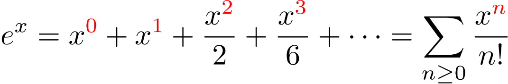
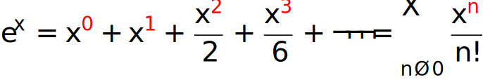

## **How to render a LaTeX math formula to PNG**

In fact, the easiest way to demonstrate the **LaTeX math formula** rendering feature is to start with the example. Here it is:



Let's get to the details. First of all, we create a [rendering options](https://reference.aspose.com/tex/java/com.aspose.tex/PngMathRendererOptions) instance, similar to the TeX/LaTeX typesetting. We do it here simultaneously specifying the output image resolution.

Next, we specify the preamble. The default preamble is:
```tex
\usepackage{amsmath}
\usepackage{amsfonts}
\usepackage{amssymb}
```
which provides slightly more advanced math formula support than basic LaTeX. You can, for example, add the `color` package if you want to use your own highlighting in the formula, as we showed in the code example.

Then we instruct the renderer to scale the output by 300%.

Next two options define the foreground and background colors. Those parts of the formula that are not covered ("colored") by the custom highlighting will be displayed in the `TextColor` color.

The next line of the example doesn't make much sense. It just demonstrates that you can direct the log output to some stream.

And the last option `ShowTerminal` allows you to toggle writing the terminal output to the console.

The method that actually performs the rendering is [MathRenderer.render()](https://reference.aspose.com/tex/java/com.aspose.tex/MathRenderer#render-java.lang.String-java.io.OutputStream-com.aspose.tex.MathRendererOptions-com.aspose.tex.Size2D-). It returns the size of the formula in points as an output argument. To use this size later we declare the variable in the next line.

The stream where the image is to be written is accepted by the method as the second argument. We create the stream next.

And finally, we call the `MathRenderer.render()` method itself, passing options as the third argument. The LaTeX code of the formula is passed as the first argument.

The last lines of the example print two artifacts of math formula rendering - the size of the formula and the brief error report (in case there were errors).

Here is the result of rendering.

[](math-formula.png)

This is the most general use case for **LaTeX math formula** rendering.

**You may also check out the free [web app](https://products.aspose.app/tex/equation-editor/png) built based on the feature implemented within [Aspose.TeX for .NET](https://products.aspose.com/tex/net/) API. [Here](https://products.aspose.com/tex/java/) is the Java version page.**

## **How to render a LaTeX math formula to SVG**

In much the same way, we can render a LaTeX math formula to SVG format.



The differences are:
 * We use [SvgMathRendererOptions](https://reference.aspose.com/tex/java/com.aspose.tex/SvgMathRendererOptions) class instead of [PngMathRendererOptions](https://reference.aspose.com/tex/java/com.aspose.tex/PngMathRendererOptions).
).
 * We don't specify resolution.
 * We use [SvgMathRenderer](https://reference.aspose.com/tex/java/com.aspose.tex/SvgMathRenderer) class instead of [PngMathRenderer](https://reference.aspose.com/tex/java/com.aspose.tex/PngMathRenderer).

Here is the result:

[](math-formula.svg)

**You may also check out the free [web app](https://products.aspose.app/tex/equation-editor/svg) built based on the feature implemented within [Aspose.TeX for .NET API](https://products.aspose.com/tex/net/).**