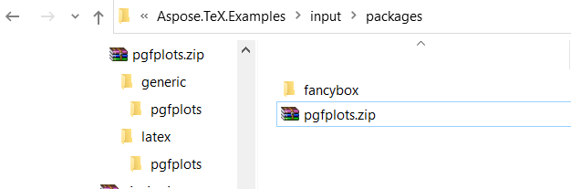
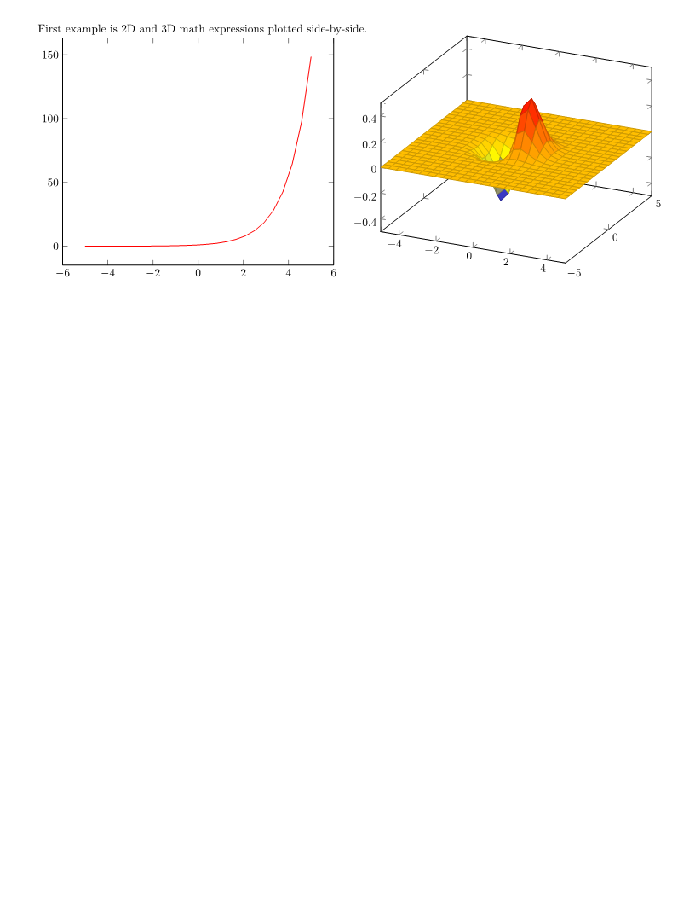

## **External LaTeX packages**

The **Aspose.TeX** library includes a number of common LaTeX packages. For example, `eurosym`, `geometry`, `graphics/graphicx`, `hyperref`, `pgf/tikz`, `pict2e`, `xcolor`. So you don't have to worry about how to provide these packages to the library's TeX engine. But sometimes (or quite often) your LaTeX file may require a package beyond the "natively" supported "bundle" of packages. If this is the case, you can try to provide the required input, i.e. required package's source files, via the [RequiredInputDirectory](https://reference.aspose.com/tex/net/aspose.tex/texoptions/requiredinputdirectory/) option of the [TeXOptions](https://reference.aspose.com/tex/net/aspose.tex/texoptions/) class instance. We will see how this works with two examples.

### **Unpacked required input (`fancybox` package)**

Let's say we have the following simple LaTeX file, which is `required-input-fs.tex` from our [example solution](https://github.com/aspose-tex/Aspose.TeX-for-Java):

```tex
\documentclass{article}
\usepackage[a6paper,landscape]{geometry}
\usepackage{fancybox}
\begin{document}
Test: \fbox{
  \begin{Bitemize}[b]
  \item First item
  \item A second one\\ on two lines
  \item(2pt) A third with extra space
  \end{Bitemize}
}
\par\bigskip
Test: \fbox{
  \begin{Beqnarray}[t]
  y & = & x^2 \\
  a^2 + 2ab + b^2 & = & (a + b)^2 \\
  \int_0^\infty e^{-ax} dx & = & \frac{1}{a}
  \end{Beqnarray}
}
\end{document}
```

On the 3rd line, we can see that the file requires the `fancybox` package, which is not "natively" supported. Let's also assume that we have the `fancybox` package source file. It is a simple package, so it really consists of a single file. We can place this file anywhere in our file system and specify the directory path as simply as shown below:

```Java
options.setRequiredInputDirectory(new InputFileSystemDirectory("path-to-directory-where-fancybox.sty-located"));
```

After running a TeX job with this option (don't forget to adjust the other options as needed), we get the output document (i.e., a PNG image).


Here is the complete source code for the example:



### **Archived required input (`pgfplots` package)**

Let's now say that we have the following also quite simple LaTeX file, which is `required-input-zip.tex` from our example solution:
```tex
\documentclass{article}
\usepackage[margin=0.25in]{geometry}
\usepackage{pgfplots}
\pgfplotsset{width=10cm,compat=1.9}
\begin{document}

First example is 2D and 3D math expressions plotted side-by-side.

%Here begins the 2D plot
\begin{tikzpicture}
\begin{axis}
\addplot[color=red]{exp(x)};
\end{axis}
\end{tikzpicture}
%Here ends the 2D plot
\hskip 5pt
%Here begins the 3D plot
\begin{tikzpicture}
\begin{axis}
\addplot3[
    surf,
]
{exp(-x^2-y^2)*x};
\end{axis}
\end{tikzpicture}
%Here ends the 3D plot

\end{document}
```

On the 3rd line, we can see that the file requires the `pgfplots` package, which is also not "natively" supported. Again, we assume that we have the `pgfplots` package source files. It's quite a large number of files that are divided between two locations if you find them in the installation directory of any LaTeX typesetting application. You can find `pgfplots` folder at both `\tex\generic` and `\tex\latex` folders. And the contents of both these folders must be provided as required input to the Aspose.TeX library. We want these source file to be packaged in a ZIP archive, so here is the archive's layout:



And this is how we specify the access to these source files:

```Java
final Stream zipStream = File.Open("path-to-zip-with-pgfplots-sources"), FileMode.Open))
try {
    ...
    options.setRequiredInputDirectory(new InputZipDirectory(zipStream));
    ...
} finally {
    if (zipStream != null)
        zipStream.close();
}

```

After running a TeX job with this option, we get the output document:



Here is the complete source code for the example:



### **Restrictions**

It may happen that a package required by your LaTeX file is developed under the `LaTeX3e` kernel. Such a package will most likely not work with the **Aspose.TeX** library since the latter is based on the `LaTeX2e` kernel.

It may also happen that a package required by your LaTeX file uses device-dependent primitive control sequences that are not supported by the **Aspose.TeX** library's `Object TeX` engine. Such a package, unfortunately, will not work for sure.
