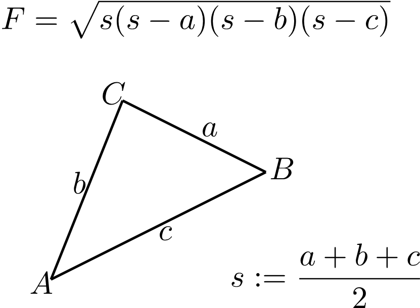
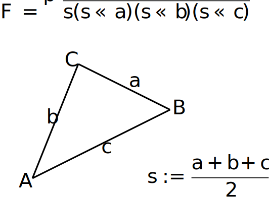

Sometimes you may want to extract some content from a LaTeX file as a separately rendered piece, or a *"figure"*, without any connection to the page layout. It can be an illustration for your publication on the Internet, for example. You can do it with our API. As for the target formats, there are two options - PNG and SVG. As is in case with the LaTeX math formula rendering feature. It's also worth noting that **LaTeX figure rendering** is a generalization of [LaTeX math formula rendering](/tex/net/latex-math-formula-rendering).

## **How to render a LaTeX figure to PNG**

The API reference section related to this topic is [here](https://reference.aspose.com/tex/net/aspose.tex.features/). And as with formula rendering, we will start with an example. Here it is:



First of all, we create a [rendering options](https://reference.aspose.com/tex/net/aspose.tex.features/figurerendereroptions/) instance. We do it here simultaneously specifying the output image resolution.

Next, we specify the preamble. There's no default preamble for LaTeX figure rendering, so if you are, for instance, going to render some graphics plotted using the `pict2e` LaTeX package, you need to specify it in the preamble:
```tex
\usepackage{pict2e}
```

Then we instruct the renderer to scale the output by 300%.

The next option defines the background color. Unlike with math formula rendering, we don't specify a foreground color since we assume that the colors are entirely under the control of the LaTeX code. In fact, so is the background color, so this is just a convenience option.

The next line of the example doesn't make much sense. It just demonstrates that you can direct the log output to some stream.

And the last option `ShowTerminal` allows you to toggle writing the terminal output to the console.

The method that actually performs the rendering is [FigureRenderer.Render()](https://reference.aspose.com/tex/net/aspose.tex.features/figurerenderer/render/). It returns the size of the figure in points as an output argument. To use this size later we declare the variable in the next line.

The stream where the image is to be written is accepted by the method as the second argument. We create the stream next.

And finally, we call the `FigureRenderer.Render()` method itself, passing options as the third argument. The LaTeX code of the figure is passed as the first argument.

The last lines of the example print two artifacts of figure rendering - the size of the figure and the brief error report (in case there are errors).

Here is the result of rendering.

[](text-and-formula.png)

This is the most general use case for the **LaTeX figure rendering** feature.

## **How to render a LaTeX figure to SVG**

In much the same way, we can render a LaTeX figure to SVG format.



The differences are:
 * We use [SvgFigureRendererOptions](https://reference.aspose.com/tex/net/aspose.tex.features/svgfigurerendereroptions/) class instead of [PngFigureRendererOptions](https://reference.aspose.com/tex/net/aspose.tex.features/pngfigurerendereroptions/).
 * We don't specify resolution.
 * We use [SvgFigureRenderer](https://reference.aspose.com/tex/net/aspose.tex.features/svgfigurerenderer/) class instead of [PngFigureRenderer](https://reference.aspose.com/tex/net/aspose.tex.features/pngfigurerenderer/).
 
Here is the result:

[](text-and-formula.svg)