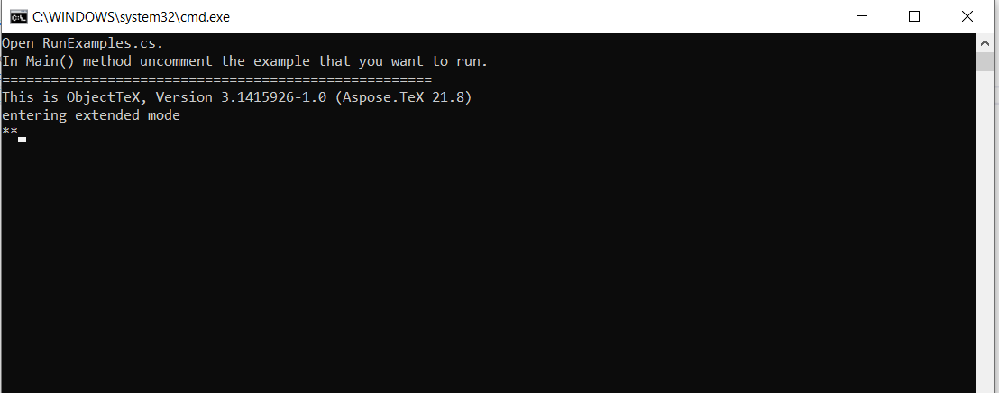

## **Providing the main input file as a stream**

Up to this point, we only knew how to pass the [main input file](/tex/net/tex-io/#tex-input) as a file name, whether fully specified or in short form, whether with an extension or without it. But there's another [constructor](https://apireference.aspose.com/tex/net/aspose.tex/texjob/constructors/1) of the `TeXJob` class, which takes a stream as the first argument. This is convenient if for some reason we have the main input file in a form other then a file on the disk file system. Here's how it can be implemented:



Note that all output files will have the name *texput*. That's because the engine can't get any other name anywhere. *texput* is the default job name. [Here](/tex/net/tex-io/#tex-output) and [here](/tex/net/other-options/#how-to-set-the-job-name) are details about job names.

## **Entering the main input file from the terminal**

There's yet another [constructor](https://apireference.aspose.com/tex/net/aspose.tex/texjob/constructors/main) of the `TeXJob` class, which doesn't let us specify the input at all. So what is such TeX job going to process, you may wonder? This time we will need an input terminal. The engine will ask us to enter the file name from the terminal.

Here is the code:



As soon as it's run, the engine sticks, waiting for us to enter the file name (with or without a path, with or without an extension):




And this is how it would look on the output terminal which is the console:

```text
This is ObjectTeX, Version 3.1415926-1.0 (Aspose.TeX 21.8)
entering extended mode
**<path_to_the_file>/hello-world.ltx
(<path_to_the_file>/hello-world.ltx
LaTeX2e <2011/06/27>
(article.cls
Document Class: article 2007/10/19 v1.4h Standard LaTeX document class
(size10.clo))
No file hello-world.aux.
[1]
(<output_directory>\hello-world.aux) )
Output written on hello-world.xps (1 page).
Transcript written on hello-world.log.
```