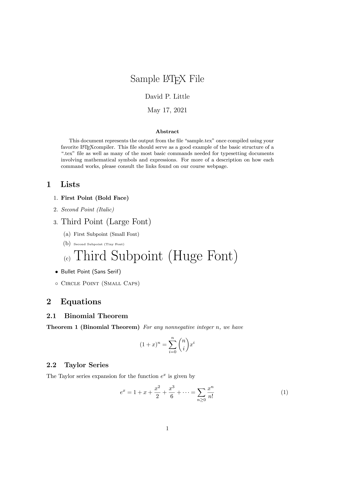
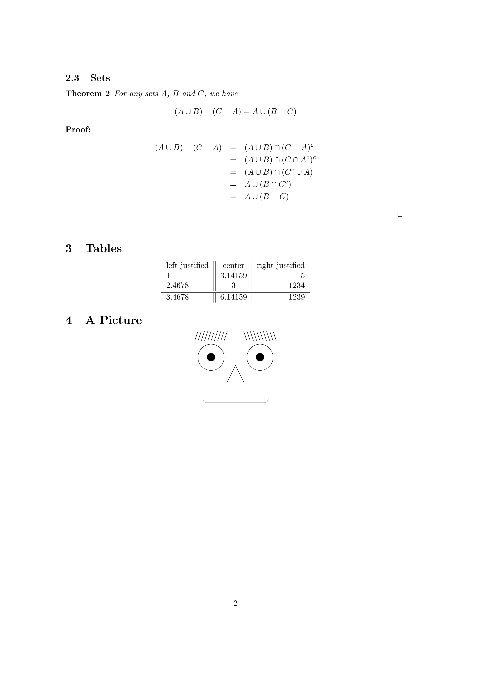

So, What is LaTeX?

LaTeX is the TeX format, in short.

LaTeX (*LAH-tekh or LAY-tekh*, often stylized as LATEX) is a software system for document preparation that was originally written in the early 1980s by [Leslie Lamport](https://en.wikipedia.org/wiki/Leslie_Lamport) at [SRI International](https://en.wikipedia.org/wiki/SRI_International). This is what [Wikipedia](https://en.wikipedia.org/wiki/LaTeX) tells.

Answering the question "What is LaTeX?" we would like to mention some of its features.

One of the most impressive features of LaTeX is the New Font Selection Scheme (NFSS). It's the macro subsystem which allows you to change individual properties of the current font, rather than defining a new font as a whole, as it worked in the original TeX (Plain TeX didn't offer much for this either). For example, you have the current font that is Computer Modern Roman italic, and you want to switch to a bold font the same type that is physicaly located in a different font file. In original TeX you need to control sequences mapped to font file names, so to switch, you just need to call another command. But the price is too many control sequences. In LaTeX you need to just ask the engine to change the typeface. It will select the appropriate current font for you.

Another feature is a number of so-called document classes. These are auxiliary input files that contain the values of TeX's internal parameters corresponding to a specific document type, like a book, article, letter, or anything else.

LaTeX also includes support for various features that may be convenient for a document author. These features are usually collected in auxiliary input files called packages. In the packages you can find advanced tools for math typesetting, drawing graphics, support for fonts that are not part of the LaTeX distribution, etc. Even for drawing 2D chemical formulas.

Here is relatively small example:

```tex
\documentclass[]{article}
%%%%%%%%%%%%%%%%%%%
% Packages/Macros %
%%%%%%%%%%%%%%%%%%%
\usepackage{amssymb,latexsym,amsmath}     % Standard packages
%%%%%%%%%%%
% Margins %
%%%%%%%%%%%
\addtolength{\textwidth}{1.0in}
\addtolength{\textheight}{1.00in}
\addtolength{\evensidemargin}{-0.75in}
\addtolength{\oddsidemargin}{-0.75in}
\addtolength{\topmargin}{-.50in}
%%%%%%%%%%%%%%%%%%%%%%%%%%%%%%
% Theorem/Proof Environments %
%%%%%%%%%%%%%%%%%%%%%%%%%%%%%%
\newtheorem{theorem}{Theorem}
\newenvironment{proof}{\noindent{\bf Proof:}}{$\hfill \Box$ \vspace{10pt}}  
%%%%%%%%%%%%
% Document %
%%%%%%%%%%%%
\begin{document}
\makeatletter
\def\@date{May 17, 2021}
\makeatother

\title{Sample \LaTeX ~File}
\author{David P. Little}
\maketitle
\begin{abstract}
This document represents the output from the file ``sample.tex" once compiled using your favorite \LaTeX compiler.  This file should serve as a good example of the basic structure of a ``.tex" file as well as many of the most basic commands needed for typesetting documents involving mathematical symbols and expressions.  For more of a description on how each command works, please consult the links found on our course webpage.
\end{abstract}
\section{Lists}
%%%%%%%%%%%%%%%
\begin{enumerate}
\item {\bf First Point (Bold Face)}
\item {\em Second Point (Italic)}
\item {\Large Third Point (Large Font)}
    \begin{enumerate}
        \item {\small First Subpoint (Small Font)} 
        \item {\tiny Second Subpoint (Tiny Font)} 
        \item {\Huge Third Subpoint (Huge Font)} 
    \end{enumerate}
\item[$\bullet$] {\sf Bullet Point (Sans Serif)}
\item[$\circ$] {\sc Circle Point (Small Caps)} 
\end{enumerate}
\section{Equations}
%%%%%%%%%%%%%%%%%%%
\subsection{Binomial Theorem}
\begin{theorem}[Binomial Theorem]
For any nonnegative integer $n$, we have
$$(1+x)^n = \sum_{i=0}^n {n \choose i} x^i$$
\end{theorem}
\subsection{Taylor Series}
The Taylor series expansion for the function $e^x$ is given by
\begin{equation}
e^x = 1 + x + \frac{x^2}{2} + \frac{x^3}{6} + \cdots = \sum_{n\geq 0} \frac{x^n}{n!}
\end{equation}
\subsection{Sets}
\begin{theorem}
For any sets $A$, $B$ and $C$, we have
$$ (A\cup B)-(C-A) = A \cup (B-C)$$
\end{theorem}
\begin{proof}
\begin{eqnarray*}
(A\cup B)-(C-A) &=& (A\cup B) \cap (C-A)^c\\
&=& (A\cup B) \cap (C \cap A^c)^c \\
&=& (A\cup B) \cap (C^c \cup A) \\
&=& A \cup (B\cap C^c) \\
&=& A \cup (B-C)
\end{eqnarray*}
\end{proof}
\section{Tables}
%%%%%%%%%%%%%%%%
\begin{center}
\begin{tabular}{l||c|r}
left justified & center & right justified \\ \hline
1 & 3.14159 & 5 \\
2.4678 & 3 &  1234 \\ \hline \hline
3.4678 & 6.14159 & 1239
\end{tabular}
\end{center}
\section{A Picture}
%%%%%%%%%%%%%%%%%%%
\begin{center}
\begin{picture}(100,100)(0,0)
\setlength{\unitlength}{1pt}
\put(20,70){\circle{30}}  \put(20,70){\circle*{10}}   % left eye
\put(80,70){\circle{30}}  \put(80,70){\circle*{10}}   % right eye
\put(40,40){\line(1,2){10}} \put(60,40){\line(-1,2){10}} \put(40,40){\line(1,0){20}} % nose
\put(50,20){\oval(80,10)[b]} % mouth
\multiput(0,90)(4,0){10}{\line(1,3){4}}  % left eyebrow
\multiput(100,90)(-4,0){10}{\line(-1,3){4}}  % right eyebrow
\end{picture}
\end{center}
\end{document}
```

And here are two pages of output:

[](example-page-1.png)
[](example-page-2.png)

Naturally, we do not pretend to have any complete answer to the question "What is LaTeX?", since this is quite a large amount of information. Since writing a LaTeX file is still programming, you will have to spend some time if you want to get better acquainted with it. Do you want it or not.